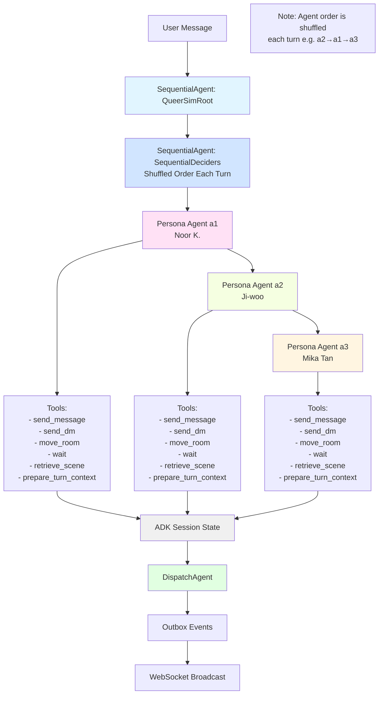

# LLM Queer Simulation

A social simulation platform for AI agents interacting in various rooms, with configurable personas, system prompts, and RAG (Retrieval-Augmented Generation) support. Built with **Google ADK (Agent Development Kit)** for robust multi-agent orchestration.

## Features

- **Multi-Agent Simulation**: AI agents with distinct personas interacting in real-time using Google ADK orchestration.
- **Dynamic Sequential Agent Execution**: Persona agents run sequentially in a shuffled order each turn, ensuring each agent sees different state updates and produces more varied, contextual responses.
- **Independent Context Search**: Each agent can independently search RAG knowledge bases based on their own perspective.
- **Stateful Sessions**: Persistent conversation state and agent memory managed by ADK session service.
- **Configurable Personas**: Easily change agent names and backgrounds via the frontend.
- **Dynamic System Prompt**: Customize the core behavior of all agents.
- **Generalized RAG Support**: Upload and use `.md`, `.txt`, and `.srt` files for agent knowledge.
- **YouTube Video Knowledge**: Ingest YouTube videos (URL) with automatic transcription (Whisper), translation (GPT), and visual frame captioning (GPT-Vision).
- **Settings Page**: Full control over simulation parameters without touching code.
- **WebSocket Communication**: Real-time updates and interactions.

## Project Structure

- `queer-sim-backend/`: FastAPI server with Google ADK orchestration, agent logic, and RAG system.
  - `adk_sim/`: ADK-based simulation package with state management, tools, and agent definitions.
  - `adk_sim/agents/`: Agent definitions (personas, root orchestration).
  - `adk_sim/tools.py`: ADK tools for message sending, room movement, RAG search, scene retrieval.
  - `adk_sim/state.py`: Session state schema and helpers.
- `queer-sim-frontend/`: Next.js web interface.
- `data/rag/`: Directory for RAG data files.

## Getting Started

### Prerequisites

- **Google API Key** (recommended): For Gemini models via Google ADK. Get one from [Google AI Studio](https://makersuite.google.com/app/apikey).
- [Ollama](https://ollama.com/) (optional fallback): If not using Google API, Ollama must be installed and running.
- [FFmpeg](https://ffmpeg.org/) installed and available in PATH (for video/frame processing).
- Python 3.9+
- Node.js 18+

### YouTube Ingestion Setup (Optional)

To use the YouTube ingestion feature, you need an OpenAI API key for translation and vision-based frame captioning.

1. Set `OPENAI_API_KEY` in your environment or in `queer-sim-backend/config.json`.
2. Ensure `ffmpeg` is installed.
3. The first time you ingest a video without subtitles, the system will download the `faster-whisper` large-v3 model (~3GB).

### LLM Setup

**Option 1: Google Gemini (Recommended)**

1. Get a Google API key from [Google AI Studio](https://makersuite.google.com/app/apikey).
2. Set the `GOOGLE_API_KEY` environment variable or add it to your `.env` file.

**Option 2: Ollama (Fallback)**

1. Install Ollama and pull the models:

   ```bash
   ollama pull qwen3
   ollama pull embeddinggemma
   ```

2. The system will automatically use Ollama if no Google API key is provided.

### Backend Setup

1. Navigate to the backend directory:
   ```bash
   cd queer-sim-backend
   ```

2. Install dependencies:
   ```bash
   pip install -r requirements.txt
   ```

3. Configure environment variables in a `.env` file:
   ```
   # For Google Gemini (recommended)
   GOOGLE_API_KEY=your_google_api_key_here

   # OR for Ollama (fallback)
   OLLAMA_BASE=http://localhost:11434
   CHAT_MODEL=qwen3
   EMBED_MODEL=embeddinggemma
   ```

4. Start the server:
   ```bash
   uvicorn server:app --reload --port 8000
   ```

### Frontend Setup

1. Navigate to the frontend directory:
   ```bash
   cd queer-sim-frontend
   ```

2. Install dependencies:
   ```bash
   npm install
   ```

3. Start the development server:
   ```bash
   npm run dev
   ```

4. Open [http://localhost:3000](http://localhost:3000) in your browser.

## Configuration

### Settings Page

Access the settings via the "Settings" button on the main chat interface. From there you can:

- **Rename Agents**: Change the display names of the AI agents.
- **Edit Personas**: Update the background stories and behaviors of agents.
- **System Prompt**: Modify the global instructions given to all agents.
- **Initial Messages**: Set the seed conversation that appears when the simulation starts.
- **RAG Directories**: Switch between different sets of knowledge or upload new documents.

### Manual Configuration

Settings are stored in `queer-sim-backend/config.json`. You can edit this file directly or via the UI.

## RAG (Retrieval-Augmented Generation)

The simulation supports using external documents to inform agent conversations.

1. Create a new directory under `queer-sim-backend/data/rag/` or use the UI to create one.
2. Add `.txt`, `.md`, or `.srt` files to the directory.
3. Select the directory in the Settings page.
4. Agents will now search these documents for relevant context during conversations.

## Architecture

The simulation uses **Google ADK** for agent orchestration with a dynamic sequential multi-agent architecture:

### Agent Pipeline



### Key Features

- **Dynamic Sequential Execution**: Persona agents run sequentially in a randomly shuffled order each turn, ensuring each agent sees different conversation states and produces more varied, contextual responses
- **State-Aware Responses**: Each agent sees state updates from previous agents in the sequence, allowing them to build on each other's responses naturally
- **Independent Context Search**: Each agent can independently search RAG using `prepare_turn_context` based on their own perspective
- **Output Collection**: Agents write their replies to state keys (`a1_reply`, `a2_reply`, `a3_reply`) which are then dispatched by a dedicated DispatchAgent
- **State Management**: ADK session service maintains conversation history, agent positions, and room state
- **Event-Driven**: Tools emit events to an outbox that gets flushed to WebSocket clients
- **Enhanced Scene Retrieval**: `retrieve_scene` tool returns both transcript text and frame image data

The ADK implementation provides:
- Robust error handling and recovery
- Persistent state across turns
- Structured workflow orchestration
- Easy extensibility for new agent behaviors


## Open-Source Friendliness

This project is designed to be easily customizable:
- All hardcoded configurations have been moved to a central config system.
- Personas and prompts are fully editable via the UI.
- RAG system is generic and supports standard document formats.
- Agent orchestration uses standard Google ADK patterns for easy modification.

## License

MIT
